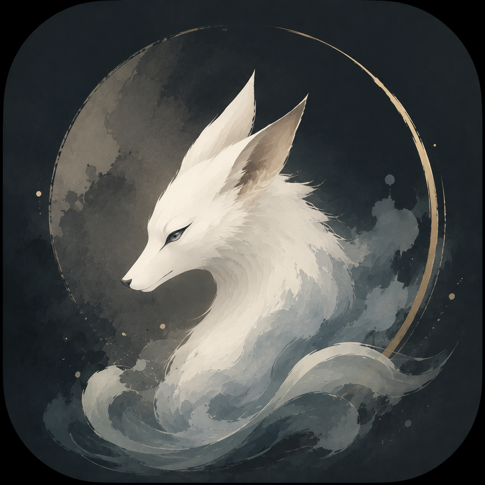

<div align="center">
  
  <h1>Soundist 声境</h1>
  <p><strong>让声音成为一处可以停留的地方。</strong></p>
  <p><em>A place to stay, made of sound.</em></p>
</div>

---

有些时刻，我们并不需要更多信息。

只需要雨落在窗上，风从树梢经过，远处列车缓慢驶向夜色；或者一段不过分打扰的音乐，让思绪有地方安静下来。

Soundist 收集这些细微的声音，也让它们与时间、专注和记忆发生联系。你可以用它读书、写作、放空、入睡，也可以只是戴上耳机，在自己的声音世界里待一会儿。

## 在声境里

- 将雨、风、河流、火焰、城市与许多日常声音混合成自己的环境。
- 进入会持续生长和变化的声场，或从开放音乐中找到今晚想听的频道。
- 开始一段专注，设好睡眠时间，让声音在该离开时安静退场。
- 随手记下念头、清单、图片、录音与手写痕迹。
- 回看声音陪你走过的时间，以及那些慢慢形成的习惯。

Soundist 不要求登录，也不要求持续联网。声音、笔记与记录首先属于你的设备，也属于你自己。

## 不只是播放器

在 Soundist 里，声音不会停留在某一个页面。

它可以陪你开始一场番茄钟，在笔记里留下当时的声场，也可以在一天结束后，成为记录里一段有温度的上下文。环境声、电台、专注、睡眠和笔记不是彼此孤立的工具，而是同一段体验里的不同片刻。

首页的深海星云会回应正在发生的声音。它不追赶你，也不催促你，只是安静地告诉你：此刻，声境正在呼吸。

## 从哪里开始

Soundist 当前优先支持 Android。仓库包含完整原生应用与离线声音资源，首次克隆需要一些时间。

<details>
<summary>从源码构建</summary>

需要 JDK 17、Android SDK 36、Android NDK 27 与 CMake 3.22.1。

```powershell
git clone https://github.com/cozylove-girl/Soundist.git
cd Soundist
.\gradlew.bat :app:assembleDebug
```

更完整的发布与真机检查见 `RELEASE_CHECKLIST.md`。

</details>

## 关于这个项目

Soundist 从 [Moodist](https://github.com/remvze/moodist) 出发，但已经沿着另一条方向生长：从一组可以混合的环境声，走向一个围绕声音、时间与个人记录展开的移动空间。

感谢 Moodist 与所有开放音乐、演奏、采样和工具的创作者。每一份被收录的第三方内容都保留自己的来源与许可记录。

## 一起让它更好

欢迎提出真实使用中的感受：哪一种声音让你愿意久留，哪个动作打断了沉浸，哪段动画太急，哪项记录还不够诚实。

Issue、建议和 Pull Request 都很珍贵。提交代码、图片或音频前，请确认你拥有相应的分享权利。

## 许可

Soundist 愿意公开源码、接受讨论与共同改进，但不允许未经授权的商业复制。

- Soundist 自有代码采用 [PolyForm Noncommercial 1.0.0](LICENSE)，中文参考见 [LICENSE.zh-CN.md](LICENSE.zh-CN.md)。
- 商业使用需要事先取得仓库所有者的书面许可。
- Moodist 衍生部分继续遵守 [Moodist MIT License](LICENSES/Moodist-MIT.txt)。
- 音频、采样和第三方代码遵守各自的许可与署名要求。
- Soundist 名称、Logo、狐狸形象、图标与启动插画不随代码授权，详见 [品牌素材声明](BRAND_ASSETS_LICENSE.md)。

完整来源与致谢见 [NOTICE.md](NOTICE.md) 和 [THIRD_PARTY_AUDIO_NOTICES.md](THIRD_PARTY_AUDIO_NOTICES.md)。
